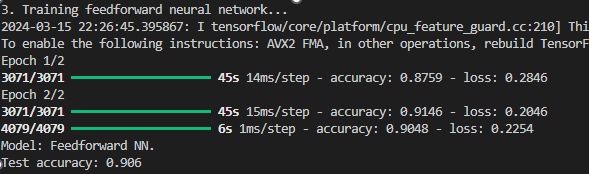
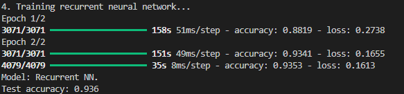

# Sentiment Analysis using Feedforward and Recurrent Neural Networks

## Overview

This project aims to perform sentiment analysis on a dataset of restaurant reviews using two types of neural networks: Feedforward Neural Networks (FNNs) and Recurrent Neural Networks (RNNs). The goal is to classify reviews as positive or negative.

## Dataset

The dataset used for this project is a preprocessed version of the Yelp dataset, containing text-based reviews. Due to size constraints, the dataset is not included in this repository. Follow the instructions below to download the dataset.

### Downloading the Dataset

1. Download the preprocessed dataset from the following link: [Download keras-data.pickle](https://file.io/aCjRYJSDlaNj).
2. Place the downloaded file in the root directory of the project.

## Installation

Before running the code, you need to install the required Python packages. This project is tested on Python 3.8 and TensorFlow 2.9. You can install the necessary packages using `pip`:

```bash
pip install tensorflow
pip install numpy
```

## Output

The script prints the test accuracy of both the Feedforward Neural Network and the Recurrent Neural Network:

* Test accuracy for Feedforward NN:

* Test accuracy for Recurrent NN:
